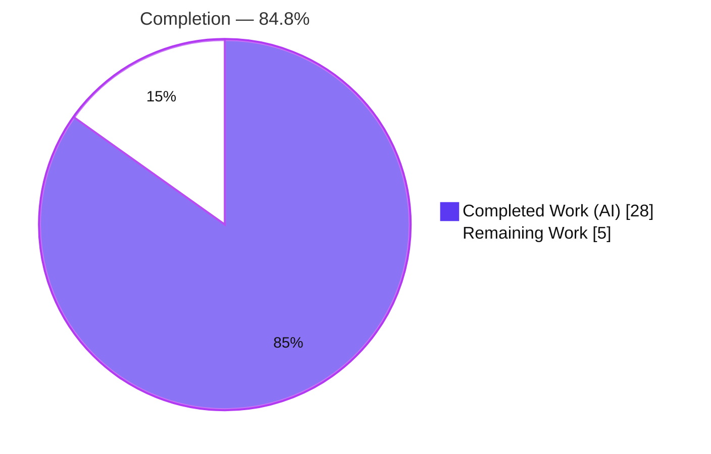
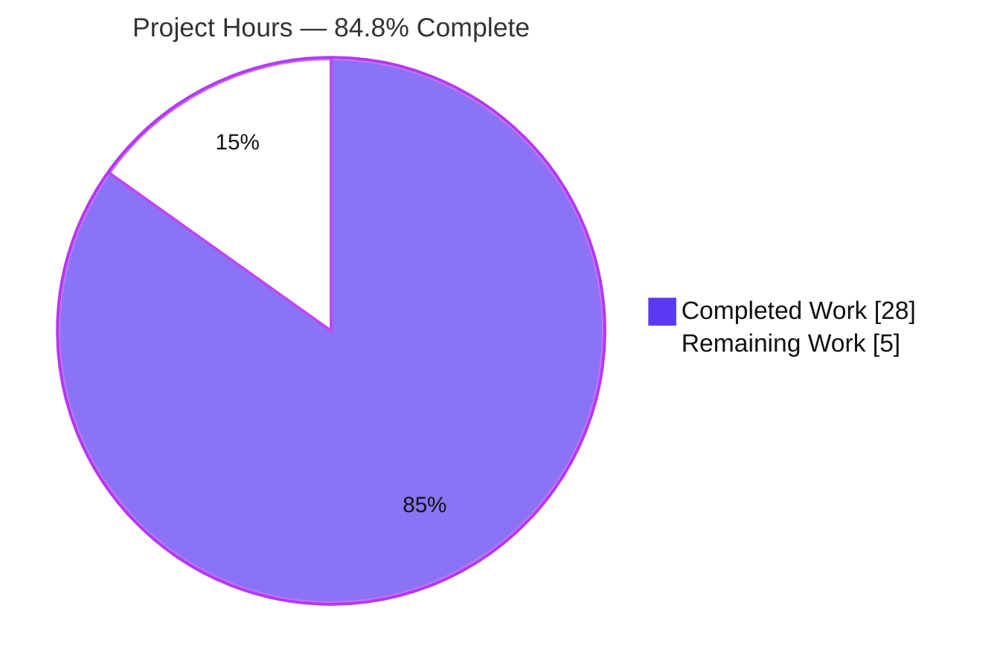
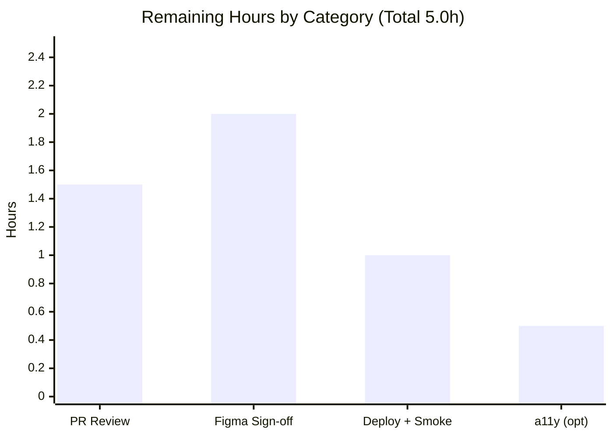

# Blitzy Project Guide — DogeSCM Integration (shadcn-admin)

> **Feature:** Add a "DogeSCM" source-control integration to the App Integrations page (`/apps`) — a catalog card plus a guided "Connect" flow dialog, frontend-only with a mocked backend.
> **Branch:** `blitzy-71a12337-33b6-420e-bb29-4bd3138b22f6` · **HEAD:** `cf2634c` · **Author:** Blitzy Agent &lt;agent@blitzy.com&gt;

---

## 1. Executive Summary

### 1.1 Project Overview
This project adds a new **DogeSCM** source-control integration to the App Integrations page (`/apps`) of the **shadcn-admin** dashboard (v2.2.1) — a React 19 + Vite frontend-only SPA using TanStack Router, Tailwind CSS v4, and vendored shadcn/ui primitives. The deliverable is a catalog card plus a guided "Connect" flow dialog (workspace URL + optional access token) with client-side Zod validation and a mocked backend. It targets dashboard end-users connecting integrations and is a **narrow, additive, isolated** feature that reuses existing design-system primitives — no new components, dependencies, routes, or global state. Business impact: extends the integrations catalog with a self-contained, production-ready UI pattern that can later be wired to a real DogeSCM backend.

### 1.2 Completion Status



| Metric | Hours |
|--------|-------|
| **Total Project Hours** | **33.0** |
| Completed Hours (AI) | 28.0 |
| Completed Hours (Manual) | 0.0 |
| **Completed Hours (AI + Manual)** | **28.0** |
| **Remaining Hours** | **5.0** |
| **Percent Complete** | **84.8%** |

> Completion is computed on AAP-scoped + path-to-production work only: **28.0 ÷ 33.0 = 84.8%**. All feature code is delivered, compiles, and passes 100% of the regression suite; the remaining 5.0h is human-gated path-to-production (review, Figma sign-off, deploy).

### 1.3 Key Accomplishments
- ✅ **DogeSCM brand icon** created (`icon-dogescm.tsx`) following the `SVGProps` + `role='img'` + `<title>` + `cn()` convention and exported from the barrel alphabetically.
- ✅ **Catalog data entry** appended preserving the exact `{ name, logo, connected, desc }` shape (16th integration).
- ✅ **Guided Connect dialog** (`connect-dogescm-dialog.tsx`) composed from vendored `Dialog + Form + Input + Button`, driven by react-hook-form + `zodResolver` (`mode: 'onChange'`), Zod v4 `z.url()` (http/https-only), optional access token (min 10 chars).
- ✅ **Mocked backend** (~600ms client-side promise) — no real network calls; success toast, `onConnected` callback, dialog close, and form reset.
- ✅ **Page wiring** — local `dogeConnected` state, name-gated dialog (only DogeSCM is interactive), `isConnected` fed to both the button and the connected-type filter.
- ✅ **Zero out-of-scope changes** — `git diff` = exactly 5 files (+353/−29); no `ui/*`, route, theme, or dependency edits.
- ✅ **Quality gates green** — `tsc -b && vite build` (3976 modules), `eslint .`, `prettier --check`, and **130/130 tests** all pass.
- ✅ **Runtime validated** — full connect flow + responsive screenshots at 375/768/1024/1440/1920px (Blitzy Chrome subagent, 2 PASS runs).

### 1.4 Critical Unresolved Issues

| Issue | Impact | Owner | ETA |
|-------|--------|-------|-----|
| _None blocking._ All feature code compiles, lints, formats, and passes 100% of tests; runtime validated. | No release blocker | — | — |

> There are **no critical unresolved issues**. Remaining items (§1.6, §2.2) are standard human-gated path-to-production activities, not defects.

### 1.5 Access Issues

| System/Resource | Type of Access | Issue Description | Resolution Status | Owner |
|-----------------|----------------|-------------------|-------------------|-------|
| Figma design (node `1-2993`) | Design-file read access | Figma was referenced by **URL only** and was not machine-accessible as structured data, so an authoritative pixel-match sign-off could not be performed autonomously (documented AAP §0.5.4 / §0.10.2 gap). Screenshots at all 5 breakpoints were captured for comparison. | Open — needs a human with Figma access | Design / Frontend reviewer |

### 1.6 Recommended Next Steps
1. **[High]** Review and merge the DogeSCM PR — verify containment (exactly the 5 in-scope files), code quality, and Zod/RHF conventions (~1.5h).
2. **[High]** Perform the Figma visual parity sign-off against node `1-2993` at all 5 breakpoints using the captured screenshots; snap any off-token values to the nearest Tailwind token (~2.0h).
3. **[Medium]** Merge to trigger the Netlify build, then smoke-test `/apps` (card render, connect flow, toast, connected state) on the deployed URL (~1.0h).
4. **[Low]** _Optional:_ Address the pre-existing "Filter apps" search-input a11y/autofill advisory in a separate, out-of-scope follow-up PR (~0.5h).

---

## 2. Project Hours Breakdown

### 2.1 Completed Work Detail

| Component | Hours | Description |
|-----------|-------|-------------|
| DogeSCM SVG brand icon + barrel export | 2.0 | `icon-dogescm.tsx` (SVGProps, `role='img'`, `<title>`, `cn`) + additive alphabetical export in `index.ts` (AAP obj. 2). |
| Catalog data entry | 1.0 | Appended DogeSCM record to `apps.tsx` preserving the `{ name, logo, connected, desc }` shape (AAP obj. 1). |
| Connect-flow dialog | 11.0 | `connect-dogescm-dialog.tsx` — `Dialog+Form+Input+Button`, RHF + `zodResolver` (`onChange`), Zod v4 `z.url()`, optional token, mock connect, success toast, `onConnected` (AAP obj. 3 & 5). |
| Page wiring & connected-state integration | 3.0 | `index.tsx` — local state, name-gated dialog, `isConnected` in both button and type filter (AAP obj. 4). |
| QA / review hardening | 4.0 | 4 fix commits: dialog review findings, connect-flow QA, card description + dialog a11y, and http(s)-only URL restriction (QA F-02). |
| Best-practices research | 1.0 | Validated shadcn/ui + react-hook-form + Zod v4 dialog/form patterns for the installed majors (AAP §0.2.2). |
| Static verification | 2.0 | `tsc -b`, `vite build`, `eslint .`, `prettier --check` — all clean. |
| Runtime & responsive validation | 4.0 | Functional connect-flow verification + 5-breakpoint screenshot capture (Chrome subagent, 2 PASS runs). |
| **Total Completed** | **28.0** | Matches Completed Hours in §1.2. |

### 2.2 Remaining Work Detail

| Category | Hours | Priority |
|----------|-------|----------|
| Human PR review & merge (5-file / 353-line diff) | 1.5 | High |
| Figma visual parity sign-off — 5 breakpoints, node `1-2993` | 2.0 | High |
| Production deployment (Netlify) & post-deploy smoke test of `/apps` | 1.0 | Medium |
| Optional: pre-existing "Filter apps" a11y advisory follow-up (separate PR) | 0.5 | Low |
| **Total Remaining** | **5.0** | Matches Remaining Hours in §1.2 and §7. |

### 2.3 Hours Reconciliation
- **Completed (§2.1) 28.0 + Remaining (§2.2) 5.0 = 33.0 Total** (= §1.2 Total Hours). ✓
- **Completion = 28.0 ÷ 33.0 × 100 = 84.8%** (used identically in §1.2, §7, §8). ✓
- Remaining hours are identical across §1.2 (5.0), §2.2 sum (5.0), and §7 pie "Remaining Work" (5.0). ✓

---

## 3. Test Results

All results below originate from **Blitzy's autonomous validation logs** and were **independently re-run in this assessment session** (exit 0).

| Test Category | Framework | Total Tests | Passed | Failed | Coverage % | Notes |
|---------------|-----------|-------------|--------|--------|-----------|-------|
| Unit / Component (regression) | Vitest 4 (browser mode) · @vitest/browser-playwright · vitest-browser-react · Playwright Chromium 1217 | 130 | 130 | 0 | See note* | 21/21 test files pass. Pre-existing suite spanning `components/`, `context/`, `features/{auth,tasks,users}/`, `hooks/`, `lib/`, `stores/`. Confirms **zero regressions** from the additive DogeSCM change. |
| DogeSCM feature unit tests | — | 0 | — | — | 0%* | **None requested** by the AAP (§0.9.1) and none in scope; the feature is validated via runtime E2E instead (§4). |

- **Aggregate: 130/130 tests, 21/21 files, 100% pass rate, 0 failed / 0 skipped / 0 todo.** Duration ≈ 6.1s.
- \*Coverage was not the objective for this additive UI feature; DogeSCM has no dedicated unit test (per AAP), so its unit coverage is 0% by design. Functional correctness is established by the runtime validation in §4. The 130-test regression suite guards against side effects.

---

## 4. Runtime Validation & UI Verification

Performed by Blitzy's autonomous Chrome subagent (2 runs, both **PASS**) and re-confirmed via dev/preview HTTP checks in this session.

**Server / routing**
- ✅ Dev server (`pnpm dev`, Vite 8 @ `:5173`) — `/` → HTTP 200, `/apps` → HTTP 200 (reachable without login).
- ✅ Production preview (`pnpm preview` @ `:4173`) — `/apps` → HTTP 200.

**Functional (connect flow)**
- ✅ DogeSCM card renders: icon tile, name, exact description ("Connect DogeSCM to sync repositories and track commits."), and a "Connect" button — **name-gated as the only interactive card**.
- ✅ Dialog opens with header, Workspace URL (`type=url`) and Access Token (`type=password`) fields.
- ✅ Zod validation with exact messages: "Please enter a valid workspace URL." (rejects `javascript:`/non-http(s) schemes) and "Access token must be at least 10 characters." (blank token allowed).
- ✅ Valid submit → ~600ms mock → success toast "DogeSCM connected successfully" → dialog closes → button flips to blue **"Connected"**.
- ✅ Optional blank token succeeds. **Zero console errors** from the feature; **no real network calls** (100% client-side mock).

**Responsive / UI**
- ✅ 11 screenshots at **375 / 768 / 1024 / 1440 / 1920px** (initial + connected) plus a 1440 open-dialog capture — no overflow/clipping at any breakpoint; grid flows 1→2→3 columns; dialog centered at `sm:max-w-md`. Saved under `blitzy/screenshots/`.
- ⚠ **Figma visual parity sign-off pending** — screenshots captured and internally consistent, but authoritative match to Figma node `1-2993` requires a human with Figma access (§1.5).

Legend: ✅ Operational · ⚠ Partial · ❌ Failing

---

## 5. Compliance & Quality Review

AAP deliverables and guardrails cross-mapped to Blitzy quality/compliance benchmarks.

| Benchmark / Guardrail | Status | Progress | Notes |
|-----------------------|--------|----------|-------|
| Containment — only 5 in-scope files changed | ✅ Pass | 100% | `git diff e16c87f..HEAD` = exactly 5 files (+353/−29); zero out-of-scope edits. |
| Reuse primitives — no new design-system components | ✅ Pass | 100% | Composes vendored `Dialog/Form/Input/Button`; no `ui/*` source edits. |
| Preserve data shape `{ name, logo, connected, desc }` | ✅ Pass | 100% | Shape unchanged; entry matches the user example verbatim. |
| Icon convention (`SVGProps`, `role='img'`, `<title>`, `cn`) | ✅ Pass | 100% | Mirrors `icon-github.tsx`. |
| Form pattern (RHF + `zodResolver`, `mode: 'onChange'`) | ✅ Pass | 100% | Mirrors `profile-form.tsx`; dialog structure mirrors `users-invite-dialog.tsx`. |
| Zod v4 top-level validators (`z.url()`) | ✅ Pass | 100% | `z.url({ protocol: /^https?$/ })`. |
| No new dependencies | ✅ Pass | 100% | Zero lockfile drift (`package.json`/`pnpm-lock.yaml` unchanged). |
| Type-check / build (`tsc -b && vite build`) | ✅ Pass | 100% | Exit 0, 3976 modules, strict TS. |
| Lint (`eslint .`) | ✅ Pass | 100% | Exit 0, zero violations. |
| Format (`prettier --check .`) | ✅ Pass | 100% | Exit 0, all files conform. |
| Regression tests | ✅ Pass | 100% | 130/130, 21/21 files. |
| Accessibility (`DialogTitle`, aria wiring, `role='img'`) | ✅ Pass | 100% | Dialog a11y fix applied (commit `6df1953`). |
| Security (CWE-200; URL scheme hardening) | ✅ Pass | 100% | Toast never surfaces token/URL; URL restricted to http(s) (QA F-02). |
| Responsive screenshot capture at 5 widths | ✅ Pass | 100% | 11 screenshots captured. |
| Figma visual parity sign-off | ⚠ Partial | ~50% | Screenshots captured; authoritative match pending human w/ Figma access. |

**Fixes applied during autonomous validation:** four QA/review-driven commits — dialog review findings (`e238c6a`), connect-flow QA (`5e51b59`), card description + dialog a11y (`6df1953`), and http(s)-only workspace URL (`cf2634c`). The final consolidated validation pass found **zero** new defects (0 code changes required).

**Outstanding:** Figma visual parity sign-off (§1.5, §2.2).

---

## 6. Risk Assessment

Overall posture: **LOW** — no Critical/High risks and zero blockers. All code compiles, lints, formats, passes 130/130 tests, and runs.

| # | Risk | Category | Severity | Probability | Mitigation | Status |
|---|------|----------|----------|-------------|-----------|--------|
| 1 | Figma visual parity not authoritatively verified (node `1-2993` inaccessible to the pipeline) | Technical / Integration | Medium | Medium | Human compares captured 5-breakpoint screenshots to Figma; snaps any off-token value to the nearest Tailwind token | Open — needs human w/ Figma access |
| 2 | No dedicated automated tests for the DogeSCM feature | Technical | Low | Low | Runtime-validated via Chrome subagent (2 PASS runs); optional component test in a follow-up | Open (accepted per AAP §0.9.1) |
| 3 | Backend is a client-side mock (~600ms), not a live integration | Integration | Low | N/A (by design) | Replace `connectDogeSCM()` mock with a real API client + error/retry/timeout paths when a backend exists | Open (out of scope by design) |
| 4 | Connected state is ephemeral (local `useState`); resets on reload | Operational | Low | N/A (by design) | Persist via a real `GET /status` + store when a backend/global state is introduced | Open (by design) |
| 5 | Access token handled client-side; must be transmitted securely once a backend exists | Security | Low | Low | Currently never transmitted/logged; toast omits token & URL (CWE-200); enforce HTTPS + no-log on real wiring | Mitigated |
| 6 | URL-scheme injection (`javascript:`/`data:`/`file:`) via workspace URL | Security | Low | Low | `z.url()` restricted to `http(s)` only (QA F-02, `cf2634c`) | Closed |
| 7 | Pre-existing "Filter apps" search input lacks `id`/`name` (DevTools a11y/autofill hint) | Technical | Low | Low | Proven pre-existing (base `e16c87f`); out of scope; optional 0.5h follow-up PR | Open (non-blocking, out of scope) |
| 8 | Production deploy not yet performed/verified | Operational | Low | Low | Merge → Netlify auto-deploy → smoke-test `/apps` connect flow | Open (path-to-production) |

---

## 7. Visual Project Status



**Remaining hours by category (§2.2):**



**Priority distribution of remaining work:** High = 3.5h (PR review + Figma), Medium = 1.0h (deploy), Low = 0.5h (optional a11y).

> Integrity: pie "Completed Work" = 28 and "Remaining Work" = 5 match §1.2 and the §2.2 total exactly. Colors: Completed = Dark Blue `#5B39F3`, Remaining = White `#FFFFFF`.

---

## 8. Summary & Recommendations

**Achievements.** The DogeSCM integration is **functionally complete and production-ready as code**. All five AAP in-scope files were delivered across nine focused `agent@blitzy.com` commits that map cleanly to the AAP build order (icon → barrel → data → dialog → wiring → QA hardening). The change is fully contained (exactly 5 files, +353/−29), reuses the vendored design system, adds no dependencies, and delivers robustness beyond the baseline (AbortController cancellation, unmount-safety, duplicate-submit guard, CWE-200-safe toasts, http(s)-only URLs). Every quality gate is green — build (3976 modules), lint, format, and **130/130 regression tests** — and the connect flow plus responsive layout were runtime-verified across all five required breakpoints.

**Remaining gaps & critical path.** The project is **84.8% complete** (28.0 of 33.0 hours). The remaining **5.0 hours are entirely human-gated path-to-production**: (1) PR review & merge, (2) the Figma visual parity sign-off — the one genuine gap, since Figma node `1-2993` was URL-only and not machine-accessible (AAP §0.5.4/§0.10.2), and (3) deployment + smoke test on Netlify. An optional 0.5h follow-up may clear a pre-existing, out-of-scope search-input a11y advisory.

**Success metrics.** 5/5 in-scope files delivered; 14/15 AAP requirements fully met (the 15th — Figma sign-off — is partially met with screenshots captured); 0 out-of-scope changes; 0 new dependencies; 100% test pass rate.

**Production readiness.** **Ready to merge pending human review and Figma sign-off.** Risk posture is LOW with no blockers. Recommend proceeding with the §1.6 next steps in priority order. Note the feature is a UI shell over a **mock**; making it a live integration (real `POST /connect`, `GET /status`, persisted state) is future work explicitly outside this AAP.

| Metric | Value |
|--------|-------|
| Completion | 84.8% |
| AAP requirements met (full / partial / not-started) | 14 / 1 / 0 |
| In-scope files delivered | 5 / 5 |
| Quality gates passed | build · lint · format · 130/130 tests |
| Blockers | 0 |

---

## 9. Development Guide

> All commands below were executed successfully in this assessment session. Run from the repository root.

### 9.1 System Prerequisites
- **Node.js 20+** (CI baseline is Node 20; verified locally on Node 22). 
- **pnpm 9+** — install with `npm install -g pnpm@9`.
- **git**. OS: Linux / macOS / WSL2. **No backend, database, or Docker required** (frontend-only SPA).
- For the test suite only: **Playwright Chromium** (installed via `pnpm test:browser:install`).

### 9.2 Environment Setup
No environment variables are required to run or view the DogeSCM feature — the `/apps` route is reachable without authentication. An optional `.env` may define the Clerk auth key (unrelated to DogeSCM):

```bash
# .env (optional — NOT required for /apps or DogeSCM)
VITE_CLERK_PUBLISHABLE_KEY=
```

### 9.3 Dependency Installation
```bash
pnpm install --frozen-lockfile
# → "Lockfile is up to date"; "Already up to date"; Done in ~1s (zero drift)
```

### 9.4 Build, Lint, Format & Test (verification)
```bash
pnpm build          # tsc -b && vite build  → exit 0, 3976 modules, ~957ms → dist/
pnpm lint           # eslint .              → exit 0, zero violations
pnpm format:check   # prettier --check .    → exit 0, all files conform

# Tests (first time only): install the browser used by Vitest browser mode
pnpm test:browser:install     # playwright install chromium --with-deps
pnpm test                     # vitest run --browser.headless → 21/21 files, 130/130 tests
```

### 9.5 Application Startup
```bash
# Development (hot reload)
pnpm dev            # Vite → http://localhost:5173/   (open /apps)

# Production preview (serves the built dist/)
pnpm build && pnpm preview     # → http://localhost:4173/
```

### 9.6 Verification Steps
```bash
# Dev server health
curl -s -o /dev/null -w "%{http_code}\n" http://localhost:5173/apps    # → 200

# Preview server health
curl -s -o /dev/null -w "%{http_code}\n" http://localhost:4173/apps    # → 200
```

### 9.7 Example Usage — DogeSCM Connect Flow
1. `pnpm dev` → open `http://localhost:5173/apps`.
2. Find the **DogeSCM** card (the only interactive card) → click **Connect**.
3. In the dialog, enter a **Workspace URL** and an optional **Access Token**:
   - Invalid/non-http(s) URL → *"Please enter a valid workspace URL."*
   - Token with 1–9 characters → *"Access token must be at least 10 characters."* (blank is allowed).
4. Enter e.g. `https://dogescm.example.com/workspace` (+ optional 10+ char token) → click **Authorize**.
5. After ~600ms (mock) → success toast **"DogeSCM connected successfully"** → dialog closes → button shows blue **"Connected"**.

### 9.8 Troubleshooting
- **Port 5173 in use** → Vite auto-increments, or run `pnpm dev --port 3000`.
- **Tests can't launch a browser** → run `pnpm test:browser:install` first (installs Playwright Chromium).
- **Type/build errors** → ensure Node 20+ and a clean `pnpm install --frozen-lockfile`.
- **404 on deep links in production** → handled by `netlify.toml` SPA redirect (`/*` → `/index.html`, 200).

---

## 10. Appendices

### A. Command Reference
| Command | Purpose |
|---------|---------|
| `pnpm install --frozen-lockfile` | Install exact locked dependencies |
| `pnpm dev` | Start Vite dev server (`:5173`) |
| `pnpm build` | Type-check + production build (`tsc -b && vite build`) |
| `pnpm preview` | Serve the production `dist/` (`:4173`) |
| `pnpm lint` | ESLint (`eslint .`) |
| `pnpm format:check` / `pnpm format` | Prettier check / write |
| `pnpm test` | Run tests once, headless (Vitest browser mode) |
| `pnpm test:browser:install` | Install Playwright Chromium for tests |
| `pnpm test:coverage` | Run tests with coverage |

### B. Port Reference
| Service | Port |
|---------|------|
| Vite dev server (`pnpm dev`) | 5173 |
| Vite preview server (`pnpm preview`) | 4173 |

### C. Key File Locations
| File | Mode | Purpose |
|------|------|---------|
| `src/assets/brand-icons/icon-dogescm.tsx` | CREATE | DogeSCM SVG brand icon |
| `src/assets/brand-icons/index.ts` | UPDATE | Barrel export of `IconDogeSCM` |
| `src/features/apps/data/apps.tsx` | UPDATE | DogeSCM catalog entry |
| `src/features/apps/components/connect-dogescm-dialog.tsx` | CREATE | Guided Connect-flow dialog |
| `src/features/apps/index.tsx` | UPDATE | Page wiring, local state, name-gated dialog |
| `netlify.toml` | reference | SPA redirect for production deploy |
| `.github/workflows/ci.yml` | reference | CI (Node 20): install → lint → format → tests |

### D. Technology Versions
| Technology | Version |
|-----------|---------|
| React / React-DOM | ^19.2.5 |
| TypeScript | ~6.0.3 |
| Vite | ^8.0.8 |
| Zod | ^4.3.6 |
| react-hook-form | ^7.72.1 |
| @hookform/resolvers | ^5.2.2 |
| Tailwind CSS | ^4.2.2 |
| @tanstack/react-router | ^1.168.22 |
| sonner (toasts) | ^2.0.7 |
| lucide-react | ^1.8.0 |
| @radix-ui/react-dialog | ^1.1.15 |
| Vitest / @vitest/browser-playwright / vitest-browser-react | ^4.1.4 / ^4.1.4 / ^2.2.0 |
| Playwright (Chromium 1217) | 1.59.1 |
| ESLint / Prettier | ^10.2.1 / ^3.8.3 |
| Node (local / CI) | 22.x / 20 |
| pnpm | 9.15.9 |

### E. Environment Variable Reference
| Variable | Required? | Purpose |
|----------|-----------|---------|
| `VITE_CLERK_PUBLISHABLE_KEY` | No | Clerk auth key. **Not** required for `/apps` or the DogeSCM feature (route is reachable without login). No DogeSCM-specific variables exist. |

### F. Developer Tools Guide
- **Dev server / HMR:** `pnpm dev` (Vite 8). Edit any in-scope file for instant hot reload.
- **Type-checking:** `pnpm build` runs `tsc -b` under strict TS (`strict`, `noUnusedLocals`, `noUnusedParameters`).
- **Linting:** `pnpm lint` (`eslint .`); per-file read-only check: `npx eslint <file> --no-fix`.
- **Formatting:** `pnpm format:check` / `pnpm format` (Prettier with Tailwind class sorting).
- **Testing:** `pnpm test` (Vitest browser mode, Playwright Chromium); `pnpm test:ui` for the Vitest UI; `pnpm test:coverage` for coverage.
- **Diff review:** `git diff e16c87f HEAD --stat` (the DogeSCM change set = 5 files).
- **Design system:** shadcn/ui "new-york" (source-vendored in `src/components/ui/`), configured via `components.json`; `@/*` alias → `./src/*`.

### G. Glossary
| Term | Definition |
|------|-----------|
| **AAP** | Agent Action Plan — the primary directive defining project scope and requirements. |
| **DogeSCM** | The fictional source-control integration added by this feature. |
| **Name-gated** | Interactivity conditioned on `app.name === 'DogeSCM'`, so only that card renders the dialog; the other 15 cards stay presentational. |
| **Mock backend** | Client-side promise (~600ms) simulating connect/status — no real network request. |
| **`isConnected`** | `app.connected || (app.name === 'DogeSCM' && dogeConnected)` — the effective connected value feeding both the button and the type filter. |
| **Barrel** | `src/assets/brand-icons/index.ts` re-exporting each icon (e.g., `export { IconDogeSCM } from './icon-dogescm'`). |
| **CWE-200** | Information Exposure — mitigated here by never surfacing the token/URL in the success toast. |
| **Path-to-production** | Standard human-gated activities (review, sign-off, deploy) needed to ship the delivered code. |
| **Vendored** | Design-system source committed into the repo (`src/components/ui/*`) rather than installed as an npm package. |